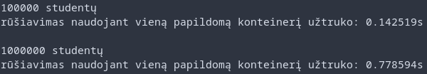

# Versija 1.5

Ši programos versija leidžia pamatyti kaip skiriasi konteinerių rūšiavimas ir grupavimas į du skirtingus konteinerius naudojant vieną naują konteinerį ir naudojant klases

## Kaip parunnint

 - `git clone https://github.com/dominykasmk/oop2.git`
 - `cd oop-test`
 - `cmake -S . -B out/`
 - `cd out/ && make`
 - `./main`

## Changelog
 
 ---
 
## [v0.1](https://github.com/dominykasmk/oop2/tree/v0.1) (22/02/2022)
 - Implementuota naudojant dinaminius C masyvus ir vektorius
## [v0.2](https://github.com/dominykasmk/oop2/tree/v0.2) (06/03/2022)
 - Pridėta galimybė nuskaityti studentus iš failo
 - Outpute studentai yra surikiuojami pagal pavardes
## [v0.3](https://github.com/dominykasmk/oop2/tree/v0.3) (06/03/2022)
 - Pridėtas exception'ų checkinimas atidarinėjant failą
 - Kodas jau buvo splittintas į headerį, metodų source'ą ir main source failą
 - Kode jau buvo naudojamos struktūros
## [v0.4](https://github.com/dominykasmk/oop2/tree/v0.4) (05/04/2022)
 - Pridėjau galimybę sugeneruoti studentų failus automatiškai
 - Programa sugeneruoja 5 studentų failus, surušiuoja pagal pažymius ir pagal tai įšveda į du skirtingus failus
 - Visi testai matuojami ir yra išvedama kiek kas laiko užėmė
## [v0.5](https://github.com/dominykasmk/oop2/tree/v0.5) (06/04/2022)
 - Implementuotas testas tikrinantis duomenų nuskaitymą iš failų ir rūšiavimą į dvi kategorijas naudojant vektorių, listą ir deką

## [v1.0](https://github.com/dominykasmk/oop2/tree/v1.0) (17/04/2022)
 - Ši versija matuoja kaip skiriasi studentų rušiavimas į dvi grupes naudojant vieną naują/du naujus konteinerius naudojant vektorių, list'ą arba dek'ą
## [v1.1](https://github.com/dominykasmk/oop3/tree/v1.1) (30/04/2022)
 - Pereita prie klasių vietoj struktūrų
 - Palyginau programos veikimo spartą naudojant struktūras ir klases ir runninant testus su vektoriais ir 100000 ir 1000000 studentų failais

### Struktūros

### Klasės

 - Palyginau testų spartą naudojant O1, O2 ir O3 kompiliatoriaus optimizavimo flagus
 
### OP1

### OP2

### OP3

## [v1.2](https://github.com/dominykasmk/oop3/tree/v1.2) (08/05/2022)
 - Pridėjau 'rule of three' konstriuktorius ir << ir >> operatorius studentų klasei
 - Pridėjau porą meniu punktų demonstruojančių įvedimą ir išvedimą naudojant << ir >> operatorius

## [v1.5](https://github.com/dominykasmk/oop3/tree/v1.2) (11/05/2022)
 - Parašiau abstrakčią klasę Human iš kurios dabar paveldėja Student
